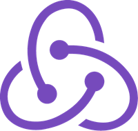

# TaskFree

TaskFree, a full-stack application inspired by Remember the Milk, is a task organizing platform where users can better manage and keep track of their tasks. Users can group similar tasks inside a list and mark individual tasks as complete. 

[Visit the site live here!](https://task-free.herokuapp.com/)

* [MVP Feature List](https://github.com/davigravi/TaskFree/wiki/MVP-Feature-List)
* [User Stories](https://github.com/davigravi/TaskFree/wiki/User-Stories)
* [Database Schema](https://github.com/davigravi/TaskFree/wiki/Dabase-Schema)
<!-- * [Frontend Routes](https://github.com/jstnswn/Instagram-Clone/wiki/Frontend-Routes)
* [API Documentation](https://github.com/jstnswn/Instagram-Clone/wiki/API-Routes) -->

# Technologies Used

# Getting Started

1. Clone the repository

       git@github.com:jstnswn/Instagram-Clone.git

2. CD into the /app directory and install dependencies

        pipenv install

3. CD into the /react-app directory and install dependencies

        npm install

4. Create a .env file based on the example with proper settings for your development environment

5. Setup your PostgreSQL user, password and database and verify that it matches your .env file

6. Start your shell, migrate your database, seed your database, and run the flask app

        pipenv shell

        flask db upgrade

        flask seed all

        flask run
       
 7. Open another terminal and change directory into /react-app and run the React app

          npm start
          
 # Features
 
 ## Splash Page
 
Users can log in with an existing account or sign up and create a new account. There is also a demo option so users can quickly explore the site.

## Navbar

Whenever a user is logged in they will be able to see the Navbar on any page. They will be able to navigate to the home page as well as log out the session. 

## Home Page

Once logged in, the home page presents the user with a feed of all their tasks as well as their lists. The user is then able to create, update, or delete a task or list of their choosing. 

## Tasks 

Clicking on the add task button will open up a form, where the user is able to create a new task with a name and content. 

Once a task is created, the user is then able to delete or edit their task. 

## Lists

Clicking on the add list button will open up a modal form, where the user is able to create a new list. 

Once a list is created, the user will then be able to interact with that list by clicking on the ellipsis. Upon doing so, a menu will pop open offering the user with the choice to either edit or delete that list. 

